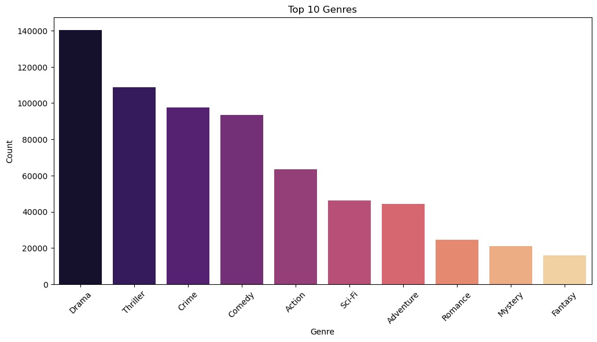

# Movie-recommendation-system

 

## Summary

## Project Overview
This project aims to enhance user experience on a streaming platform by developing a personalized movie recommendation system. We will leverage the [MovieLens dataset](https://grouplens.org/datasets/movielens/latest/), created by GroupLens, a research group in the Department of Computer Science and Engineering at the University of Minnesota. Since its inception in 1992, GroupLens has focused on various fields including: 

* recommender systems
* online communities
* mobile and ubiquitous technologies
* digital libraries
* local geographic information systems

The MovieLens platform operates a movie recommender based on collaborative filtering, making it a rich source of data for our analysis. By utilizing collaborative filtering techniques alongside a hybrid approach, this project seeks to provide tailored content recommendations that increase user engagement and retention. Our goal is to deliver relevant movie suggestions that cater to individual preferences, ultimately improving user satisfaction in a competitive streaming market.

## Business Understanding
In the context of a streaming service with a vast content library, user engagement is crucial for success. The company is experiencing lower-than-expected user interaction, characterized by reduced average watch times and higher churn rates. To combat this issue, the streaming platform recognizes the need for a sophisticated recommendation system that provides users with personalized movie suggestions based on their viewing history and rating patterns.

## Problem Statement
The streaming service faces a challenge in maintaining user satisfaction and engagement levels. Many users are not interacting with the platform as anticipated, leading to decreased watch times and an increase in user churn. The primary objective is to develop a recommendation system capable of delivering personalized movie recommendations that align with users’ preferences, thereby improving engagement and retention.

## Objectives
1. **Build a Recommendation System**: Develop a system that generates the top 5 movie recommendations for each user based on their previous ratings. The model will employ collaborative filtering techniques, supplemented by a hybrid approach to effectively tackle the cold-start problem for new users.

2. **Increase User Engagement**: Provide personalized recommendations that cater to individual tastes, encouraging users to explore additional content on the platform and ultimately leading to longer average watch times.

3. **Improve Retention**: By consistently delivering relevant recommendations, the system will work to reduce user churn, fostering loyalty to the platform over time.

4. **Personalize Content Discovery**: Allow users to discover content that aligns with their unique preferences, enhancing their connection to the platform and its offerings.

5. **Mitigate Cold-Start Problem**: Implement a hybrid recommendation strategy that combines collaborative filtering with content-based filtering to offer relevant suggestions to new users who have minimal interaction history.

## Data Understanding
The project will utilize the [MovieLens dataset](https://grouplens.org/datasets/movielens/latest/) from the GroupLens research lab at the University of Minnesota. The smaller dataset, containing 100,000 ratings and metadata for 9,000 movies rated by 600 users, includes the following files:

- **Links.csv**: Contains unique identifiers for movies, including movie IDs, TMDB IDs, and IMDB IDs.

- **Movies.csv**: Contains metadata about the movies, including titles and genres.

- **Ratings.csv**: Comprises user ratings for various movies, facilitating the collaborative filtering process.

- **Tags.csv**: Contains tags applied to movies by users, providing additional context for content-based filtering.

## Exploratory Data Analysis
- This consists of a Univariate analysis(UVA) and Bivariate analysis(BVA) of the dataset:

1. **UVA**:Distribution of Ratings.
4.0 and 5.0 are the most frequent ratings with ratings count of 60933 and 59645 respectively.

2. **UVA**:Top 10 Genres.
Drama, Thriller and Crime are the top 3 movie Genres wihle Fantasy has the lowest count.

3. **BVA**:Top 10 Most Rated Movies.
Pulp Fiction(1994) is the most rated movie with the higest rate count of above 50000.

4. **BVA**:Top 20 Highest Rated Movies.

5. **BVA**:Average Rating per Genre.
Crime | War | Thriller | Drama | Film-Noir - are the top rated genres, with an average of **4.0+**     

## Modeling

## Conclusion
- KNNBasic offers a simple yet effective baseline but suffers from moderate prediction errors. The model fails to deliver consistent performance, particularly for cold-start users and popular movies.

- KNNWithMeans improves slightly but still doesn't outperform the more advanced models, showing weaknesses in personalized recommendations.

- SVD stands out as the best-performing model with the lowest RMSE and MAE, providing diverse, accurate recommendations while addressing both overfitting and user-specific preferences.

- Content-Based Filtering serves as a useful method for mitigating cold-start problems, offering an early list of suggestions based on movie genres and tags, though its overall performance does not surpass collaborative filtering.

## Recommendations
- Adopt SVD as the Primary Model: The SVD model has demonstrated superior performance and lower prediction errors, making it the best choice for providing accurate movie recommendations.

- Incorporate a Hybrid Model: Combine SVD with Content-Based Filtering to handle new users who have not provided ratings. This will improve personalization for all users, including cold-start scenarios.

- Enhance User Feedback: Encourage users to provide feedback on the recommendations to continuously refine the model’s predictions and adapt to their evolving preferences.

- Regular Updates: The model should be retrained regularly with new data to ensure it remains up-to-date with user tastes and movie trends. This will maintain the system’s relevance and accuracy over time.

- Diversity in Recommendations: Consider implementing a diversity factor to avoid repetitive suggestions, ensuring users are exposed to a broader range of movies.

